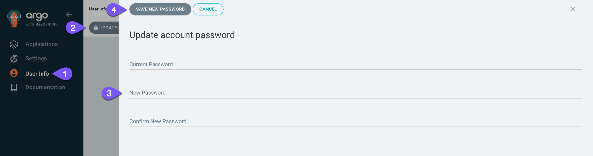
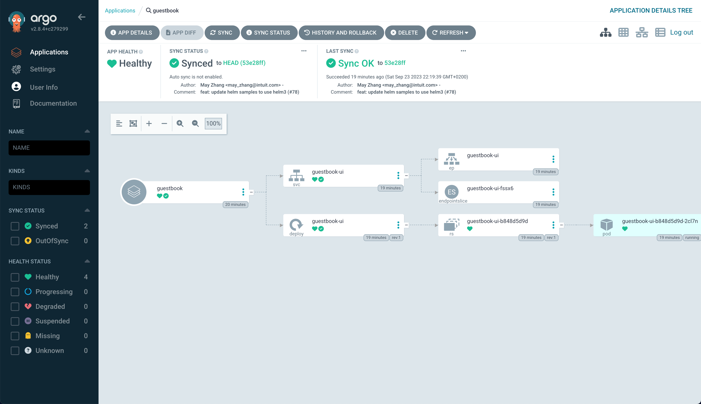
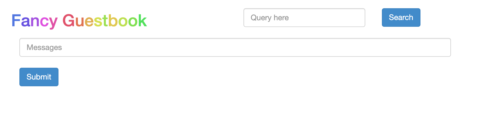

# Argo CD Installation

---
**NOTE**

Tested with Argo CD release v2.8.4 (<https://github.com/argoproj/argo-cd/releases/tag/v2.8.4>)

---

## Requirements

* Nutanix Kubernetes Engine 2.8 or later

* Kubernetes cluster 1.25.6 or later

## Installation

This installs Argo CD 2.8.4 release in `argocd` namespace:

1. Create the `argocd` namespace

    ```console
    kubectl create namespace argocd
    ```

1. Apply the manifest for Argo CD 2.8.4. If you prefer the latest stable, replace the manifest link in the next command with `https://raw.githubusercontent.com/argoproj/argo-cd/stable/manifests/install.yaml`

    ```console
    kubectl apply -n argocd -f https://raw.githubusercontent.com/argoproj/argo-cd/v2.8.4/manifests/install.yaml
    ```

# Testing

1. Get the initial password auto-generated for the `admin` user

    ```console
    kubectl -n argocd exec deployment/argocd-server -- argocd admin initial-password -n argocd
    ```

    ```
    RKZA791eFyu-JQ8O

    This password must be only used for first time login. We strongly recommend you update the password using `argocd account update-password`.
    ```

1. Make Argo CD accessible from your computer

    ```console
    kubectl -n argocd port-forward svc/argocd-server 8080:443
    ```

1. Open Argo CD <http://localhost:8080>

## Recommendations

### Install Argo CD CLI

Visit the [Argo CD documentation](https://argo-cd.readthedocs.io/en/stable/cli_installation/) to install the CLI.

Optionally, you can open a shell with `deployment/argocd-server` and run the `argocd` CLI from here (not recommended)

1. Open a shell to Argo CD server

    ```console
    kubectl -n argocd exec -it deployment/argocd-server -- /bin/bash
    ```

1. Log in to Argo CD

    ```console
    argocd login argocd-server 
    ```

    ```
    WARNING: server certificate had error: tls: failed to verify certificate: x509: certificate signed by unknown authority. Proceed insecurely (y/n)? y
    Username: admin
    Password: 
    'admin:login' logged in successfully
    Context 'argocd-server' updated
    ```

### Change password

1. Change the auto-generated password in the UI

    

1. Delete the secret `argocd-initial-admin-secret`

    ```console
    kubectl -n argocd delete secret/argocd-initial-admin-secret
    ```

### Deploy demo app

Follow the steps available in the [official Argo CD documentation](https://argo-cd.readthedocs.io/en/stable/getting_started/#6-create-an-application-from-a-git-repository)

**TL;DR**

* Run

    ```console
    kubectl -n argocd exec -it deployment/argocd-server -- /bin/bash
    argocd login argocd-server --insecure --username admin
    argocd app create guestbook --repo https://github.com/argoproj/argocd-example-apps.git --path guestbook --dest-server https://kubernetes.default.svc --dest-namespace default
    argocd app get guestbook
    argocd app sync guestbook
    ```

* Check UI <https://localhost:8080/applications/argocd/guestbook>

    

* Port-forward the `guestbook-ui` service

    ```console
    kubectl -n default port-forward svc/guestbook-ui 8081:80
    ```

* Open the webapp <http://localhost:8081>

    
