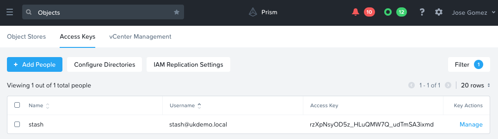
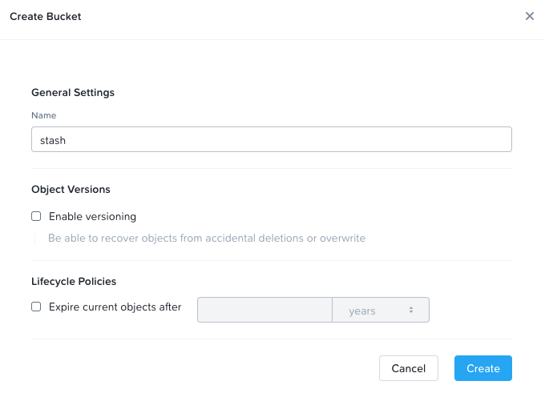
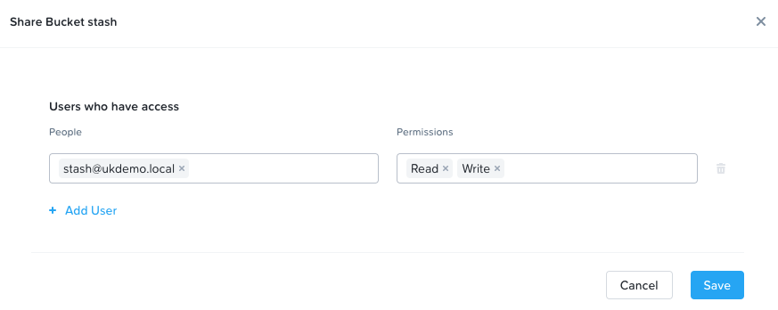

# (WIP) Tutorial: Backup with Stash and Nutanix Objects

---
**NOTE**

* Tested with Stash release v0.11.6, Karbon 2.1.2 and Kubernetes 1.16.13

* Manifest will create `backup` namespace object

---

## Requirements

* Nutanix Karbon 2.1.2 or later

* Kubernetes cluster 1.16.13 or later

* [Helm 3 CLI](https://helm.sh/docs/intro/install/)

* Available a Nutanix Objects instance 1.0 or later

* Stash Community edition license. You can get one [here](https://github.com/stashed/docs/blob/master/docs/setup/install/community.md)

## Create Bucket

1. Connect to Prism Central

2. Open Objects

3. Create an access key

    

4. Create a bucket, I called it `stash`

    

5. Entitle user access

    

## Install Stash Operator

1. Create namespace

    ```console
    kubectl create namespace backup
    ```

2. Install Stash CRD

    Move into the Stash folder and make sure to have the `license.txt` file in the folder.

    ```console
    helm repo add appscode https://charts.appscode.com/stable/
    helm repo update
    helm install stash appscode/stash \
      --version v0.11.6 \
      --namespace backup \
      --set enableAnalytics=false \
      --set-file license=license.txt
    ```

3. Check Stash deployment

    ```console
    $ kubectl get deployment --namespace backup -l "app.kubernetes.io/name=stash,app.kubernetes.io/instance=stash"
    NAME    READY   UP-TO-DATE   AVAILABLE   AGE
    stash   1/1     1            1           26s
    ```

    ```console
    kubectl get crd -l app.kubernetes.io/name=stash
    ```

    ```
    NAME                                      CREATED AT
    backupblueprints.stash.appscode.com       2020-11-10T07:25:57Z
    backupconfigurations.stash.appscode.com   2020-11-10T07:25:57Z
    backupsessions.stash.appscode.com         2020-11-10T07:25:57Z
    functions.stash.appscode.com              2020-11-10T07:25:58Z
    recoveries.stash.appscode.com             2020-11-10T07:25:57Z
    repositories.stash.appscode.com           2020-11-10T07:25:57Z
    restics.stash.appscode.com                2020-11-10T07:25:57Z
    restoresessions.stash.appscode.com        2020-11-10T07:25:57Z
    tasks.stash.appscode.com                  2020-11-10T07:25:58Z
    ```

## Create Stash Repository

In this step you will create a Stash Repository CRD that maps with the Objects bucket `stash`. You will need:

* The keys you created in the previous section

* Bucket name

* Objects URL

* Objects CA certificate

---

1. (Optional) If you have not downloaded the Objects CA certificate, continue with this step. In the folder along with the other YAML files download the CA certificate for your Objects instance. Replace the `YOUR_ENDPOINT_URL_HERE` with yours. Ex: objects.nutanix.com

    ```console
    openssl s_client -connect YOUR_ENDPOINT_URL_HERE:443 -showcerts 2>/dev/null | sed -ne '/-BEGIN CERTIFICATE-/,/-END CERTIFICATE-/p' > objects.pem
    ```

2. In the same folder create the following file replacing the values for `endpoint`, `bucket` and `prefix (optional)` with yours. This is the Stash CRD to create a repository for Objects.

    ```console
    cat <<EOF >./stash-repository.yaml
    apiVersion: stash.appscode.com/v1alpha1
    kind: Repository
    metadata:
      name: objects-repo
      namespace: backup
    spec:
      backend:
        s3:
          endpoint: YOUR_ENDPOINT_URL_HERE
          bucket: YOUR_BUCKET_NAME_HERE
          region: us-east-1
          prefix: /backup/karbon/deployment/demo # (Optional) You can replace with the path to use in the bucket to store the backups
        storageSecretName: objects-stash
    EOF
    ```

3. Create another file for the Objects secret replacing the values for `RESTIC_PASSWORD`, `AWS_ACCESS_KEY_ID` and `AWS_SECRET_ACCESS_KEY` with yours.

    ```console
    cat <<EOF >./kustomization.yaml
    secretGenerator:
    - name: objects-stash
      literals:
      - RESTIC_PASSWORD=YOUR_RESTIC_PASSWORD_HERE # Choose a new password
      - AWS_ACCESS_KEY_ID=YOUR_ACCESS_KEY_HERE
      - AWS_SECRET_ACCESS_KEY=YOUR_SECRET_KEY_HERE
      files:
      - CA_CERT_DATA
    generatorOptions:
      disableNameSuffixHash: true
    resources:
    - stash-repository.yaml
    EOF
    ```

4. Create Objects secret and Stash repository using Kubernetes Kustomize. You must be in the directory with the generated YAML files.

    ```console
    kubectl apply -k .
    ```

    ```
    secret/objects-stash created
    repository.stash.appscode.com/objects-repo created
    ```

## Backup

There is a demo application available in the `backup` folder ([file](backup/demo-workload-deployment.yaml)). The application is just a simple deployment with three replicas that have mounted a PVC. A file is written in the PVC for Stash to backup into Objects.

Within the stash folder run the following steps:

1. Deploy application with backup configuration included. The backup job runs every 5 minutes ([know more](https://stash.run/docs/v2020.11.06/guides/latest/workloads/deployment/#backup)).

    ```console
    kubectl apply -f backup/demo-workload-deployment.yaml
    ```

    ```
    persistentvolumeclaim/stash-sample-data created
    deployment.apps/stash-demo created
    backupconfiguration.stash.appscode.com/deployment-backup created
    ```

2. Verify CronJob:

    ```console
    kubectl -n backup get cronjob
    ```

    ```
    NAME                             SCHEDULE      SUSPEND   ACTIVE   LAST SCHEDULE   AGE
    stash-backup-deployment-backup   */5 * * * *   False     0        2m46s           24m
    ```

3. Wait for BackupSession:

    ```console
    watch -n 2 kubectl -n backup get backupsession
    ```

    ```
    Every 2.0s: kubectl -n backup get backupsession                                                                       laptop: Tue Nov 10 19:14:21 2020

    NAME                           INVOKER-TYPE          INVOKER-NAME        PHASE       AGE
    deployment-backup-1605035407   BackupConfiguration   deployment-backup   Succeeded   4m14s
    ```

4. Verify Backup:

    ```console
    kubectl -n backup get repository objects-repo
    ```

    ```
    NAME           INTEGRITY   SIZE   SNAPSHOT-COUNT   LAST-SUCCESSFUL-BACKUP   AGE
    objects-repo   true        12 B   5                2m52s                    18h
    ```
