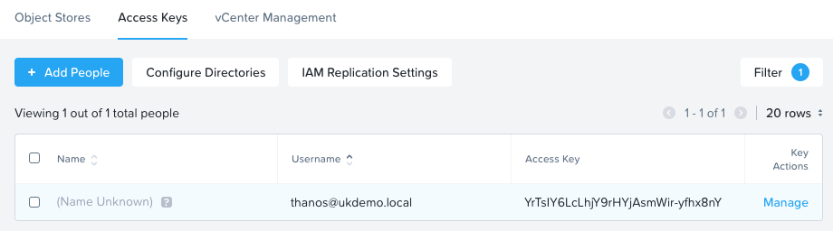
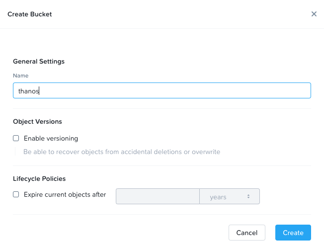
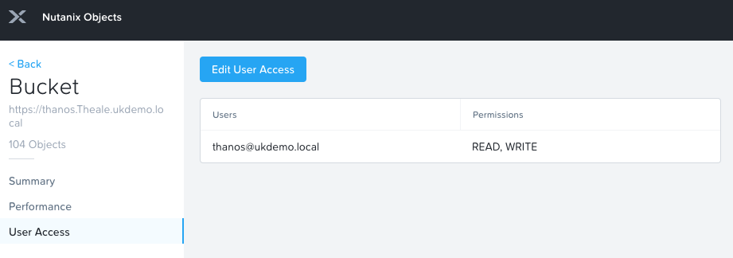

# Tutorial: Monitoring with Thanos and Nutanix Objects

---
**NOTE**

* Tested with Prometheus release v2.4.3 included with Karbon 2.1.2 & Kubernetes 1.16.13

* Manifest will create `monitoring` namespace object

---

## Requirements

* Nutanix Karbon 2.1.2 or later

* Kubernetes cluster 1.16.13 or later

* [Metrics Server](../metrics-server/README.md)

* Available a Nutanix Objects instance 1.0 or later 

## Create Bucket

1. Connect to Prism Central

2. Open Objects

3. Create an access key

    

4. Create a bucket, I called it `thanos`

    

5. Entitle user access

    

## Create Secret

In this step you will create a Kubernetes secret with the keys you created in the previous section.

1. Create a folder called `secrets` and move into it

    ```shell
    mkdir secrets && cd secrets
    ```

2. Create the following file replacing the `access_key` and `secret_key` with yours. This file will be used with Kubernetes Kustomize

    ```shell
    cat <<EOF >./kustomization.yaml
    namespace: monitoring
    secretGenerator:
        - name: objects-credentials
        literals:
            - access_key=YOUR_ACCESS_KEY_HERE
            - secret_key=YOUR_SECRET_KEY_HERE
    EOF
    ```

3. Generate Secret file

    ```shell
    kubectl kustomize . > ../secret.yaml
    ```

