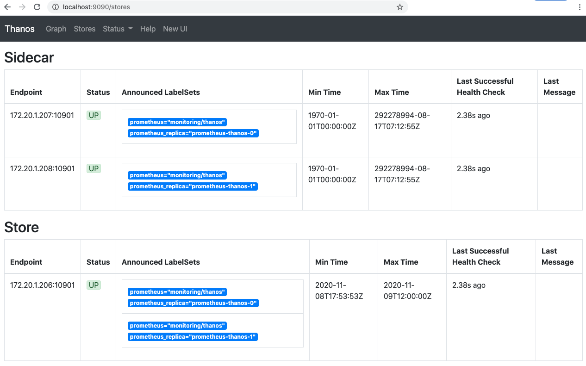

# Tutorial: Monitoring with Prometheus, Thanos and Nutanix Objects

---
**NOTE**

* Tested with Prometheus release v2.4.3 included with Karbon 2.1.2 & Kubernetes 1.16.13

* Manifest will create `monitoring` namespace object

---

## Requirements

* Nutanix Karbon 2.1.2 or later

* Kubernetes cluster 1.16.13 or later

* [Metrics Server](../metrics-server/README.md)

* Available a Nutanix Objects instance 1.0 or later 

## Create Bucket

1. Connect to Prism Central

2. Open Objects

3. Create an access key

    

4. Create a bucket, I called it `thanos`

    

5. Entitle user access

    

## Create Objects Secret

In this step you will create a Kubernetes secret with the configuration for Objects. You will need:

* The keys you created in the previous section

* Bucket name

* Objects URL

In the folder along with the other YAML files create the following file replacing the `bucket`, `endpoint`, `access_key` and `secret_key` with yours. This file will be used with Kubernetes Kustomize later

```shell
cat <<EOF >./objects.properties
type: s3
config:
  region: us-east-1
  bucket: YOUR_BUCKET_NAME_HERE
  endpoint: YOUR_ENDPOINT_URL_HERE
  access_key: YOUR_ACCESS_KEY_HERE
  secret_key: YOUR_SECRET_KEY_HERE
  http_config:
    insecure_skip_verify: true
EOF
```

## Update existing Prometheus

Before you deploy an additional monitoring stack that includes an additional Prometheus, it's important you update the existing Prometheus deployment in `ntnx-system` namespace to only monitor this namespace and `kube-system` namespace.

* Set labels for system namespaces

```shell
kubectl label ns/kube-system monitoring=k8s
kubectl label ns/ntnx-system monitoring=k8s
```

* Patch existing Prometheus deployment to limit ServiceMonitors to `k8s` label

```shell
kubectl -n ntnx-system patch --type merge prometheus/k8s -p '{"spec":{"serviceMonitorNamespaceSelector":{"matchLabels":{"monitoring": "k8s"}}}}'
```

## Deploy Thanos

In this step you will deploy a new Prometheus instance using the Prometheus Operator included in Karbon along with Thanos for metrics archiving in Nutanix Objects.

Make sure you execute the following command within the folder.

```shell
kubectl apply -k .
```

## Testing

1. Make Thanos accessible from your computer

    ```shell
    kubectl -n monitoring port-forward svc/thanos-query 9090:9090
    ```

2. Open [Thanos](http://localhost:9090)

3. Check in the Thanos page the `Stores` section

    

## Clean up

```shell
kubectl delete namespace monitoring
```

## Credits

* Based on <https://medium.com/@christophe_99995/applications-metrics-monitoring-on-nutanix-karbon-c1d1158ebcfc>

* Based on <https://www.metricfire.com/blog/ha-kubernetes-monitoring-using-prometheus-and-thanos/#Thanos-Store>